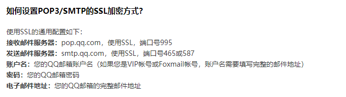
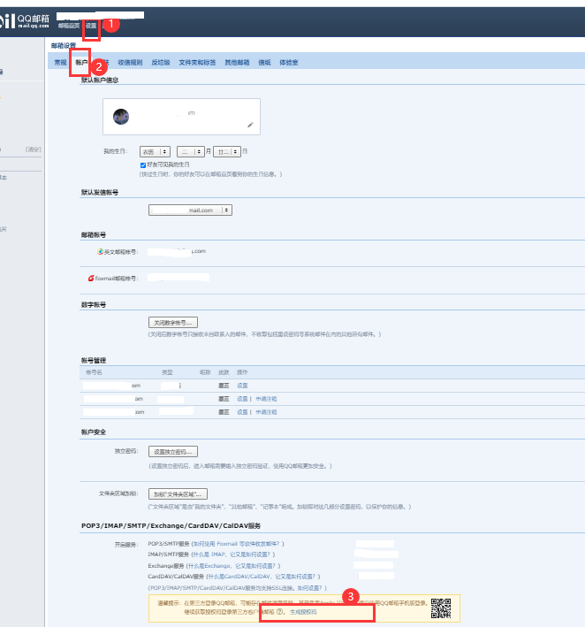

# 🚀️ youthStudy完成页面

> 使用者有责任和义务对自己的行为负责。  
> 本项目仅供学习交流使用，严禁用于其他用途! For learning and communication only, other use is strictly prohibited！
> 作者不承担任何法律责任！The author assumes no legal liability！

青年大学习获取最新完成页面，并发到指定邮箱。

## 🎉️ 使用方法

1.data.json中将下面配置信息填写在对应下方大括号内：
```
"user": "学号+姓名+",
"dir": "下载目录",
"smtpserver": "邮箱smtp服务器",
"sender": "发送邮箱",
"password": "授权码",
"receiver": "接收邮箱1,接收邮箱2",
"username": "登录邮箱"
```
2.运行main.py
### 说明
QQ邮箱smtp服务器配置：  
  

QQ获取邮箱授权码:  
  
## ❤ 感谢  
[QiYi92](https://github.com/QiYi92/Youth_Learning_Reptile)  
[zhouyumin](https://github.com/zhouyumin/qndxx)

## python打包exe
pyinstaller -F main.py
